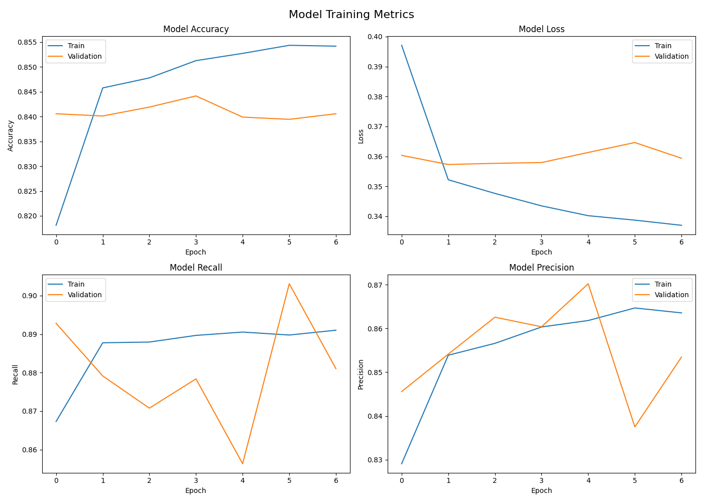
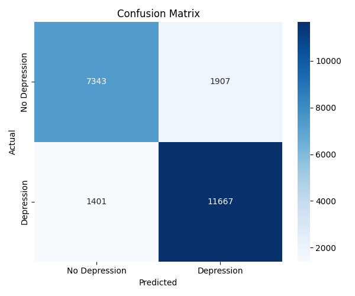
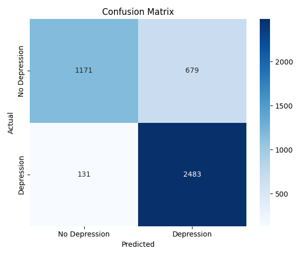
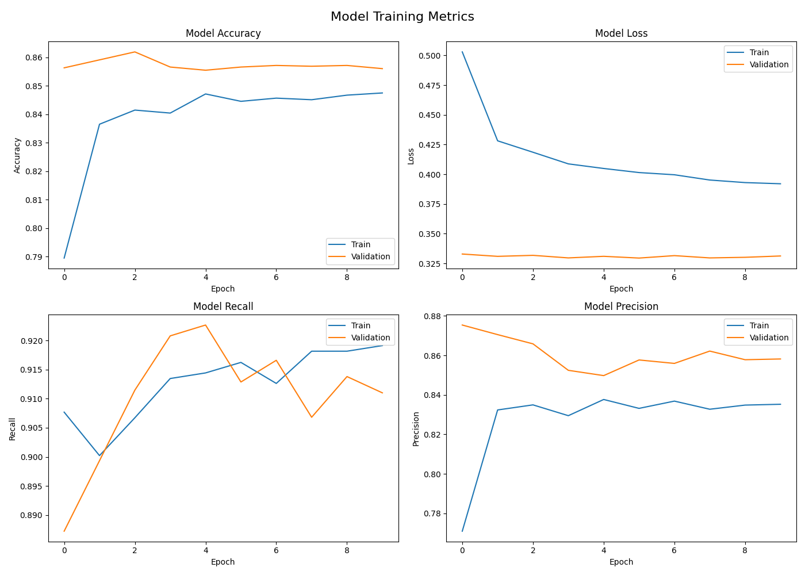

# Modelo de Depresión Estudiantil

## Descripción del Proyecto

Este proyecto tiene como objetivo desarrollar un modelo capaz de predecir si un estudiante presenta depresión a partir de factores demográficos, académicos y de estilo de vida. La meta es identificar, de forma rápida y precisa, aquellos perfiles estudiantiles con alta probabilidad de presentar depresión.

## Descripción del Dataset

Para este proyecto se utiliza el dataset  **Student Depression Dataset**, descargado de [Kaggle](https://www.kaggle.com/datasets/hopesb/student-depression-dataset). Este conjunto de datos contiene **27,901 instancias** y **18 columnas** en total, donde cada fila representa un estudiante individual.

Las variables incluyen información demográfica, académica y de hábitos de vida como edad, género, ciudad, promedio académico (CGPA), horas de sueño, hábitos alimenticios, presión académica y satisfacción con los estudios. La variable objetivo (`Depression`) es de tipo binaria (0 = sin depresión, 1 = con depresión).

### Tabla de Variables

| Variable | Tipo | Descripción |
|---|---|---|
| id | Identificador | Identificador único del estudiante |
| Gender | Categórico | Género del estudiante (Male/Female) |
| Age | Numérico | Edad del estudiante |
| City | Categórico | Ciudad de residencia |
| Profession | Categórico | Ocupación del estudiante |
| Academic Pressure | Numérico | Nivel de presión académica (escala 0-5) |
| Work Pressure | Numérico | Nivel de presión laboral (escala 0-5) |
| CGPA | Numérico | Promedio académico |
| Study Satisfaction | Numérico | Nivel de satisfacción con los estudios (escala 0-5) |
| Job Satisfaction | Numérico | Nivel de satisfacción laboral (escala 0-5) |
| Sleep Duration | Categórico | Duración promedio de sueño diario |
| Dietary Habits | Categórico | Hábitos alimenticios |
| Degree | Categórico | Nivel académico actual |
| Have you ever had suicidal thoughts? | Binario | Historial de pensamientos suicidas |
| Work/Study Hours | Numérico | Horas de trabajo o estudio por día |
| Financial Stress | Numérico | Nivel de estrés financiero |
| Family History of Mental Illness | Binario | Antecedentes familiares de enfermedad mental |
| Depression | **Target** | Variable objetivo binaria (0 = No, 1 = Sí) |

---

## Limpieza

### Eliminación de Columnas No Relevantes

Se eliminaron las siguientes columnas antes de cualquier otro procesamiento: [[1]](https://doi.org/10.1016/j.heliyon.2023.e20938)

- **`id`**: Es un identificador único sin valor predictivo, solo causaria que nuestro modelo intente encontrar una relación con nuestras demás variables.
- **`City`**: Inicialmente se habia considerado para el entrenamiento del modelo y al aplicar ténicas de exploración, se decidio clasificar este atributo entre Ciudad y Urbe. Sin embargo, al hacer buscar la relación entre este atributo y el resultado `y (Depresión)`, se determino que es inconcluso y por ende se determino eliminarlo del dataset. [[2]](https://doi.org/10.1371/journal.pone.0286366)
- **`Work Pressure`** y **`Job Satisfaction`**: Al revisar el dataset, se encontró que el **100% de los valores de estas columnas son 0**, lo que indica que los estudiantes de este dataset no tienen actividad laboral registrada. Columnas sin varianza no aportan información al modelo.
- **`Profession`**: Similar a `Work Pressure` y `Job Satisfaction`, todos los datos pertenecen a la categoria `Student`. Columnas sin varianza no aportan información al modelo.

### Validación de Columnas Categóricas

Se detectó que las columnas `Degree` y `Profession` contenían **entradas inválidas o erróneas**. Valores como nombres de personas, grados académicos en el campo de ciudad  o entradas sin sentido. Para limpiar estas columnas se aplicó un **filtro de frecuencia mínima de 10 apariciones**: cualquier valor que aparezca menos de 10 veces se considera un dato atípico o erróneo y se reemplaza con `NaN`. 

### Tratamiento de Valores Faltantes

Después de la validación categórica, el dataset presentó **34 valores faltantes** distribuidos en las columnas `Profession` (31) y `Financial Stress` (3).

Se decidió **eliminar las filas con valores faltantes** (`dropna`) en lugar de imputar un valor (como la media o moda) ya que las 60 instancias afectadas representan apenas el **0.21%** del total de **27,867 registros**, por lo que su eliminación no altera significativamente la distribución del dataset.

### Eliminación de Duplicados

Se verificó la existencia de filas duplicadas y no se encontraron duplicados en el dataset, por lo que este paso no tuvo impacto en el número de instancias.

### División del Dataset

Con los datos ya limpios, se realizó la división en subconjuntos de entrenamiento y prueba:

- **`X_train`** (80%): utilizado para entrenar el modelo
- **`X_test`** (20%): utilizado para evaluar el desempeño del modelo en datos no vistos

Se utilizó el parámetro `stratify=y` para garantizar que la proporción de instancias con y sin depresión sea la misma en ambos subconjuntos. Esto es para evitar que una clase este subrepresentada en la división de prueba.

### Preprocesamiento de Features

Se utilizó un `ColumnTransformer` de scikit-learn que aplica transformaciones distintas según el tipo de variable:

#### Variables Numéricas — `StandardScaler`

Se normalizaron las columnas `Age`, `Academic Pressure`, `CGPA`, `Study Satisfaction`, `Work/Study Hours` y `Financial Stress` utilizando **StandardScaler**, que transforma cada valor para que la distribución resultante tenga **media 0 y desviación estándar 1**: `z = (valor - media) / desviación_estándar`.

#### Variables Categóricas — `OneHotEncoder`

Se aplicó **OneHotEncoder** a las columnas `Gender`, `Sleep Duration`, `Dietary Habits`, `Degree` y `Family History of Mental Illness`, convirtiendo cada categoría en una columna binaria independiente.

## Arquitectura del Modelo

Para la selección del modelo, utilizamos aquel uno que sigue y busca resolver la misma problematica: [[5]](Yang, T. (2022). Neural networks with different initialization methods for depression detection. Proceedings of the ABCs 2022 Conference. https://users.cecs.anu.edu.au/~Tom.Gedeon/conf/ABCs2022/1-papers/1_paper_v2_2.pdf)

| Capa | Tipo | Neuronas | Activación |
|---|---|---|---|
| Oculta 1 | Dense | 64 | ReLU |
| Oculta 2 | Dense | 32 | ReLU |
| Salida | Dense | 1 | Sigmoid |

**Configuración de entrenamiento:**
- **Optimizador:** Adam
- **Función de pérdida:** Binary Crossentropy
- **Épocas máximas:** 10
- **Batch size:** 32
- **Validación durante entrenamiento:** 20% del set de entrenamiento

Se utilizó **EarlyStopping** monitoreando `val_accuracy` con `patience=3` y `restore_best_weights=True`, lo que detiene el entrenamiento automáticamente cuando la precisión del modelo deja de mejorar y restaura los pesos del mejor epoch observado.

---

## Evaluación del Modelo

### Métricas de Entrenamiento



| Métrica | No Depression | Depression | Promedio |
|---|---|---|---|
| Precision | 0.83 | 0.86 | 0.84 |
| Recall | 0.79 | 0.89 | 0.84 |
| F1-Score | 0.81 | 0.87 | 0.84 |
| **Accuracy** | - | - | **0.85** |

- **Accuracy (0.85):** El modelo clasifica correctamente al 85% de los estudiantes.

- **Precision (0.86 para Depression):** Cuando el modelo predice que un estudiante tiene depresión, acierta el 86% de las veces. Esto significa que los falsos positivos (decirle a alguien sano que tiene depresión) son relativamente bajos.

- **Recall (0.89 para Depression):** El modelo detecta correctamente al 89% de los estudiantes que realmente tienen depresión. Esta es la métrica es la más importante para este problema. [[3]](https://doi.org/10.1503/cmaj.170125)

- **F1-Score (0.87 para Depression):**  entre precision y recall. Un valor de 0.87 indica que el modelo tiene un buen equilibrio entre no generar falsas alarmas y no perderse casos reales.

---

## Matriz de Confusión



En el contexto de salud mental estudiantil, los **falsos negativos son el error más grave**. Decirle a un estudiante que padece depresión que está bien significa que no recibirá ayuda ni intervención a tiempo, lo cual puede tener consecuencias serias para su bienestar.

En contraste, un falso positivo le diría a un estudiante sano que podría tener depresión, lo que derivaría simplemente en una evaluación adicional por parte de un profesional, lo cual no representa un daño significativo.

---

### Observaciones de las Gráficas de Entrenamiento

El modelo presenta `señales de overfitting`. Esto se debe principalmente a que:

La brecha creciente entre la loss de entrenamiento y validación ya que el modelo mejora en train pero no en validación de forma proporcional y que la inestabilidad en recall y precision de validación sugiere que el modelo no está generalizando de forma estable.

## Refinamiento del Modelo

### Enfoque

El Modelo 2 surge de la necesidad de reducir los **falsos negativos** es decir, casos donde un estudiante con depresión es clasificado como sano. En un contexto de salud mental, este es el error más costoso: un estudiante que necesita ayuda no la recibirá. Para lograr esto se realizaron cambios tanto en la arquitectura como en la estrategia de entrenamiento.

---

### Arquitectura

Se duplicaron las capas y neuronas respecto al Modelo 1, añadiendo regularización progresiva mediante Dropout:

| Capa | Tipo | Neuronas | Activación | Regularización |
|---|---|---|---|---|
| Entrada | Input | 71 | - | - |
| Oculta 1 | Dense | 256 | ReLU | Dropout(0.4) |
| Oculta 2 | Dense | 128 | ReLU | Dropout(0.3) |
| Oculta 3 | Dense | 64 | ReLU | Dropout(0.2) |
| Oculta 4 | Dense | 32 | ReLU | Dropout(0.1) |
| Salida | Dense | 1 | Sigmoid | - |

### Dropout
Se implemento Dropout que desactiva aleatoriamente un porcentaje de neuronas durante cada paso de entrenamiento, forzando al modelo a aprender representaciones redundantes en lugar de memorizar, esto con el fin de contrarestar el overfitting del modelo base.

---

### Configuración de Entrenamiento

`Learning Rate: 0.0005`
Se redujo a la mitad. Esto es porque un learning rate más pequeño hace que el modelo aprenda con pasos más pequeños y precisos, reduciendo el riesgo de saltar sobre el mínimo óptimo de la función de pérdida.

`Epochs: 50`
Se aumentaron a 50 para darle al modelo más oportunidades de aprender, confiando en que `EarlyStopping` y `ReduceLROnPlateau` detendrán el entrenamiento en el momento correcto.

`Batch Size: 64`
Se usaron lotes más grandes, lo que produce estimaciones de gradiente más estables por cada actualización de pesos.

---

### Callbacks

Como se menciono previamente, se busca evitar o reducir la posibilidad de un `falso negativo`, es por eso que enfocaremos nuestros callbacks en el `recall de validación` para garantizar que nuestro modelo esta priorizando mejorar bajo esta métrica.

**EarlyStopping**

Detiene el entrenamiento si el recall de validación no mejora durante 5 epocas consecutivas, y restaura los pesos de la mejor epoca observada. Se monitorea `val_recall` en lugar de `val_accuracy` porque el objetivo principal del modelo es minimizar falsos negativos, no maximizar la precisión general.

**ReduceLROnPlateau**

Si el recall de validación no mejora durante 3 epochs, reduce el learning rate a la mitad (`factor=0.5`). Esto permite que el modelo haga ajustes más finos cuando el aprendizaje se estanca, en lugar de detenerse prematuramente. El proceso puede repetirse hasta llegar al mínimo de `0.00001`.

---

### Class Weights

Los class weights le indican al modelo cuánto penalizar cada tipo de error durante el entrenamiento. Al asignar un peso de **1.3 a la clase Depression**, cada vez que el modelo falla en identificar un estudiante deprimido, el error se multiplica por 1.3 — haciéndolo más costoso que fallar en la clase contraria.

Esto directamente incentiva al modelo a priorizar el recall de la clase Depression sobre la precisión general, resultando en **menos falsos negativos** a costa de algunos falsos positivos adicionales. En el contexto de salud mental estudiantil, este tradeoff es justificable ya que es preferible derivar a un estudiante sano a una evaluación adicional que ignorar a uno que genuinamente necesita ayuda.

---

### Resultados

| Métrica | No Depression | Depression | Overall |
|---|---|---|---|
| Precision | 0.90 | 0.78 | 0.84 |
| Recall | 0.62 | 0.95 | 0.79 |
| F1-Score | 0.73 | 0.86 | 0.80 |
| **Accuracy** | - | - | **0.816** |

### Matriz de Confusión



### Curvas de Entrenamiento



---

### Diferencias en Resultados

**Recall de 0.95 en Depression**: el modelo detecta correctamente el 95% de los estudiantes con depresión, dejando escapar solo el 5%.

**Recall de 0.65 en No Depression**: el intercambio directo del `class weight`. El modelo es más conservador y prefiere etiquetar casos dudosos como depresión para no perder ningún caso real.

**Ausencia de Overfitting**: a diferencia del modelo base, las curvas de validación se mantienen por encima o al nivel de las curvas de entrenamiento durante todo el proceso.

### Limite decisivo

Nuestro modelo base de clasificación usa un limite de **0.5**, si la probabilidad predicha es mayor a 0.5, se clasifica como positivo. En este modelo se redujo el umbral a **0.35**, lo que significa que el modelo etiqueta a un estudiante como deprimido si la probabilidad predicha es mayor al 35% en lugar del 50%. Se hizo uso de curvas ROC para determinar el threshold optimo para nuestro modelo. [[4]](https://developers.google.com/machine-learning/crash-course/classification/roc-and-auc
)

Esto se hizo con la intención de amplificar aún más el efecto de los `class weights` en la dirección correcta, ya que al bajar el umbral, el modelo es más agresivo al predecir depresión, capturando casos que con un umbral estándar habrían sido clasificados como sanos. El resultado directo es una reducción adicional de falsos negativos a costa de incrementar ligeramente los falsos positivos, lo que es un intercambio aceptable dado el contexto de salud mental del proyecto.


## Uso del Predictor

Para ejecutar el predictor, corre el siguiente comando en la raíz del proyecto:

```bash
python3 predict.py
```

El programa te hará una serie de preguntas divididas en 4 secciones. En las preguntas de selección, ingresa el **número** de la opción deseada. En las preguntas numéricas, ingresa el valor dentro del rango indicado.

> Asegúrate de tener el modelo entrenado en `./model/depression_model.h5` y el dataset original en `./dataset/dataset.csv` antes de ejecutar el predictor.

### Referencias

[1] Yang, T., He, Y., Wu, L., Ren, L., Lin, J., Wang, C., Wu, S., & Liu, X. (2023). The relationships between anxiety and suicidal ideation and between depression and suicidal ideation among Chinese college students: A network analysis. Heliyon, 9(10), e20938. https://doi.org/10.1016/j.heliyon.2023.e20938

[2] Forrest LN, Waschbusch DA, Pearl AM, Bixler EO, Sinoway LI, et al. (2023) Urban vs. rural differences in psychiatric diagnoses, symptom severity, and functioning in a psychiatric sample. PLOS ONE 18(10): e0286366. https://doi.org/10.1371/journal.pone.0286366

[3] Gilman, S. E., Sucha, E., Kingsbury, M., Horton, N. J., Murphy, J. M., & Colman, I. (2017). Depression and mortality in a longitudinal study: 1952-2011. CMAJ : Canadian Medical Association journal = journal de l'Association medicale canadienne, 189(42), E1304–E1310. https://doi.org/10.1503/cmaj.170125

[4] Google Developers. (2022). Classification: ROC and AUC. https://developers.google.com/machine-learning/crash-course/classification/roc-and-auc

[5] Yang, T. (2022). Neural networks with different initialization methods for depression detection. Proceedings of the ABCs 2022 Conference. https://users.cecs.anu.edu.au/~Tom.Gedeon/conf/ABCs2022/1-papers/1_paper_v2_2.pdf

